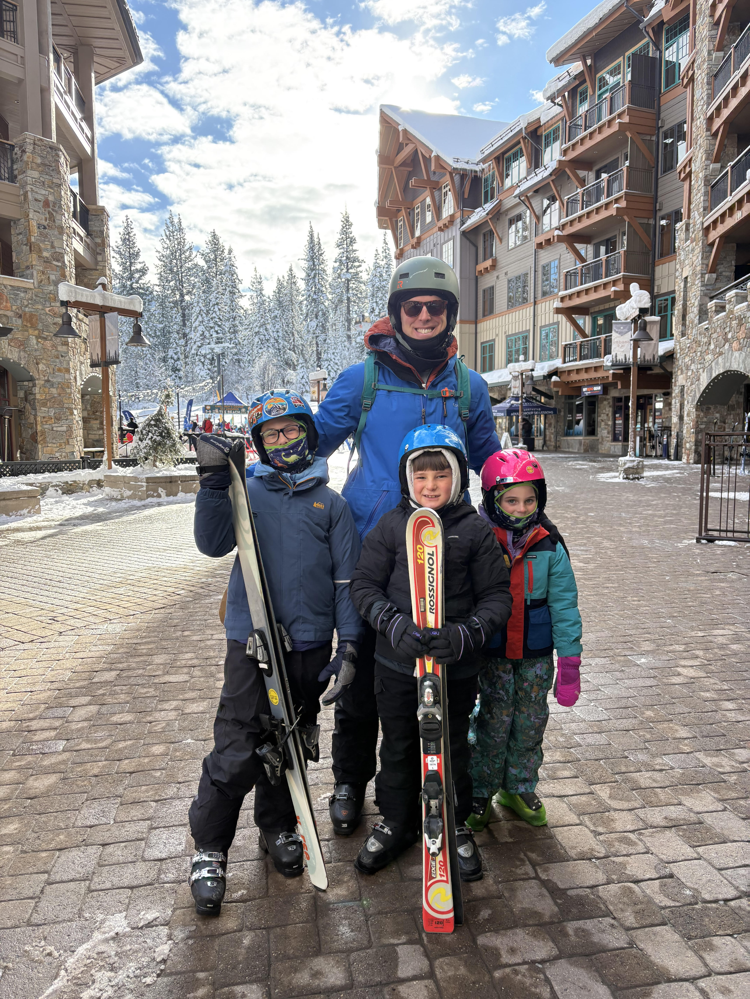

# Ian Moss



- Army Officer
- Operations Researcher
- Environmental Engineer
- Mechanical Engineer
- NY → ETH → NY → MO → HI → WA → MO → TX → GA → NY → MRY → ?
---
## Contact Me
- **Email:** ian.moss@nps.edu
- **LinkedIn:** [Ian Moss](https://www.linkedin.com/in/ian-moss-14656986/)

---

### The Family Portfolio

I have three children. They have three business ideas.

| Repo | The Pitch |
|------|-----------|
| [La-Mesa-Clean](https://github.com/ianmoss-dev/La-Mesa-Clean) | Child #1 cleans trash cans. Uses my powerwasher, my gas, my time, and he keeps the money: unsustainable. |
| [Pizza_Palooza](https://github.com/ianmoss-dev/Pizza_Palooza) | Child #2 delivers Costco pizza. Cold. For an upcharge. Customer base is suprisingly stagnant. |
| [La-Mesa-Leash-Co.](https://github.com/ianmoss-dev/La-Mesa-Leash-Co.) | Child #3 wants a dog. I said no. Compromise: she walks other people's for $5. Everyone wins: for now. |

> *For the record: the children have names. Numbering reflects order of appearance, not ranking, nor preference. Usually.*

---

### My Projects

| Repo | What it does |
|------|------------|
| [surfsup](https://github.com/ianmoss-dev/surfsup) | Efficient weekend surf preparation. Monterey conditions, tides, swell. And a proprietary algorithm to find the best spot for my lack of abilities and general fear . |
| [Fire_For_Effect](https://github.com/ianmoss-dev/Fire_For_Effect) | A Financial planning tool for Soldiers. |
| [QR-Generator](https://github.com/ianmoss-dev/QR-Generator) | Generates QR codes. Highlight of my career thus far. |

---

### Languages

```
Python        ███████░░░   getting somewhere
HTML/CSS      ███░░░░░░░   functional
JavaScript    ██░░░░░░░░   a work in progress
Military      █████████░   primary skill set
Parenting     [---------]   ERROR: task incomplete
```

---
> "Never trust a survivor until you know what he did to stay alive." — Kurt Vonnegut
---

`ianmoss-dev` · The problems are as obvious as the solutions → Angel Investor for elementary-aged kids
